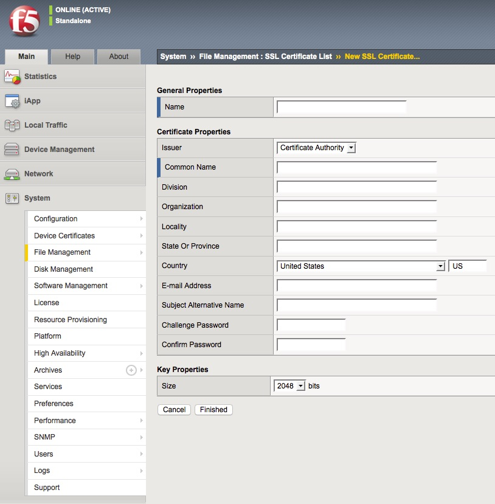

 #  Certificate Signing Request (CSR) Generation Instructions for F5 BIG-IP version 11.x
Description

This document provides Certificate Signing Request (CSR) generation instructions for F5 BIG IP 11.x. If you are not able to perform these steps on your server, Symantec recommends to contact the server vendor or the organization, which supports F5.

To generate a CSR, a key pair must be created for the server. These two items are a digital certificate key pair and cannot be separated. If the public/private key file or password is lost or changed before the SSL certificate is installed, the SSL certificate will need to be replaced. The private key, CSR and certificate must all match in order for the installation to be successful.

NOTE: All certificates that will expire after December 2013 must upgrade to a 2048-bit key size. 
Starting from BIG-IP version 11.5.0, the default signing algorithm used is SHA-2 hash algorithm which is recommended as the signing algorithm by Symantec.

To create a new Certificate Signing Request, perform the steps below:
 
### Step  1: Generating your CSR:
1. Login to the F5-BIG IP console.
1. On the left panel, Navigate to System  ››  Certificate Management : Traffic Certificate Management : SSL Certificate List
1. Click Create.
1. Type a name for the certificate.
1. From the Issuer drop down list, select Certificate Authority.
1. Fill the form to generate the CSR. ...
1. Click Finished.

 
Name: Give a name for your SSL Certificate which will be the name displayed within Big IP. The name should not have any spaces.
Issuer: Certificate Authority Symantec.
Common name: FQDN (fully-qualified domain name) of the server (e.g. www.symantec.com, mail.symantec.com, or for wildcard certificate *.symantec.com).
Division: This is also referred as the Organizational Unit.  You may use this field as a department name for the certificate or a naming convention of your choosing.
Organization: Use the legally registered organization or business name that your company operates as.
Locality, State or Province, Country: City, state, and country where the organization is located. Do not abbreviate the state or province.
E-mail Address: Your email.
Subject Alternative Name: Enter your Subject Alternative Name, also known as SANs, here if any. If you do not have any that is needed to be on the same certificate, you may leave this field blank.
Challenge Password, Confirm Password: Do not enter a challenge password. Leave the challenge password blank.
The key size must be 2048 bits for all SSL Certificates.
 
Click Finished
Verify your CSR
Copy the CSR (including the BEGIN and END tags) as seen below:

-----BEGIN CERTIFICATE REQUEST-----
              
                [encoded data]

-----END CERTIFICATE REQUEST-----
 
Proceed with the Enrollment from the Symantec web site and paste the CSR in the required field.
 
Contact Information

         During the verification process, Symantec may need to contact your organization. Be sure to provide an email address, 
         phone number and fax number that will be checked and responded to quickly. These fields are not part of the certificate.
         
         
# Installation Instructions for F5 BIG-IP version 11.x
Solution

This document provides installation instructions for F5 BIG IP 11.x. If you are not able to perform the steps on your server, DigiCert recommends to contact the server vendor or the organization, which supports F5.

Step 1. Obtain the SSL Certificate

Log into the Trust Center account. Enter in your Username and Password.
Click Sign In
From the list, select the corresponding certificate to download
Under "Available Actions" in the bottom section, click on Download your certificate
Confirm the certificate details, then click the Get Started button
Select the Server platform and Server version from the drop down menus that the certificate will be installed to
NOTE: If you are not sure of the server platform, choose "Other". This will give you the x.509 version of the certificate.
Click the Download button
A prompt window will appear to save a .zip file which will contain all neccessary certificates and additional documents and/or information for installation
 
Step 2. Install the SSL Certificate

On the left panel, navigate to System >  File Management
Choose SSL Certificate List
From the list, click on the pending request (the label from when you generated the CSR)
Click on Import

 
Select Upload file
Click on Browse
Locate the SSL certificate file then click OK
Click on Import

 
Step 3. Download and Import the Intermediate CA certificate 

Download the Intermediate CA certificate from this link: INFO657
Select the appropriate Intermediate CA certificate for your SSL Certificate type
NOTE: If you are unsure of which product you have purchased, please review the following knowledge base solution:  SO13499
Copy the Intermediate CA certificate and paste it on Vi or Notepad
Make sure there are 5 dashes to either side of the BEGIN CERTIFICATE and END CERTIFICATE and that no white spaces, extra line breaks or additional characters have been inadvertently added
Save the file as Intermediate.pem
On the left panel, navigate to System > File Management > SSL Certificate List
Click on Import (button to the right)

 
Select Certificate on the dropdown. Choose Create New and give a name for the certificate in the box below
Choose Upload File and click Browse

 
Locate the Intermediate.pem file then click OK
Click on Import

Step 4. Updating the SSL profile

On the left panel, navigate to Local Traffic > Profiles > SSL > Client
From the list, select the SSL profile for your website 
For Configuration, choose Advanced from the dropdown
Select from the dropdown the Certificate and Key imported from the previous step
Under Chain, select from the dropdown the CA intermediate previously imported

 
To apply the changes, scroll down to the bottom of the page and click Update.
Verify your installation with the DigiCert SSL Tools.
 

F5 Support
 

         For additional information, refer to F5's KB solution: SOL13302 
 
